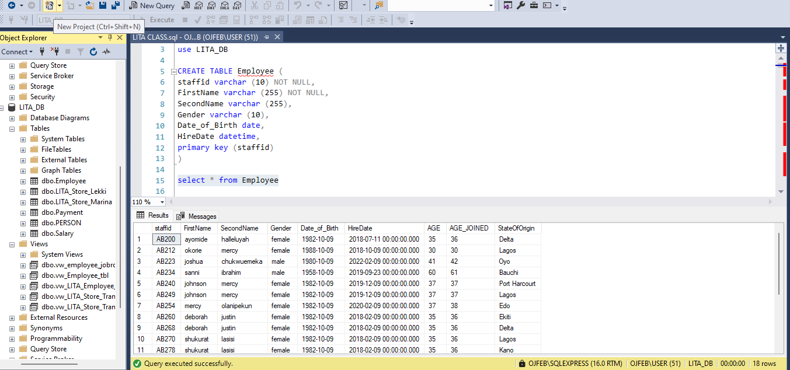
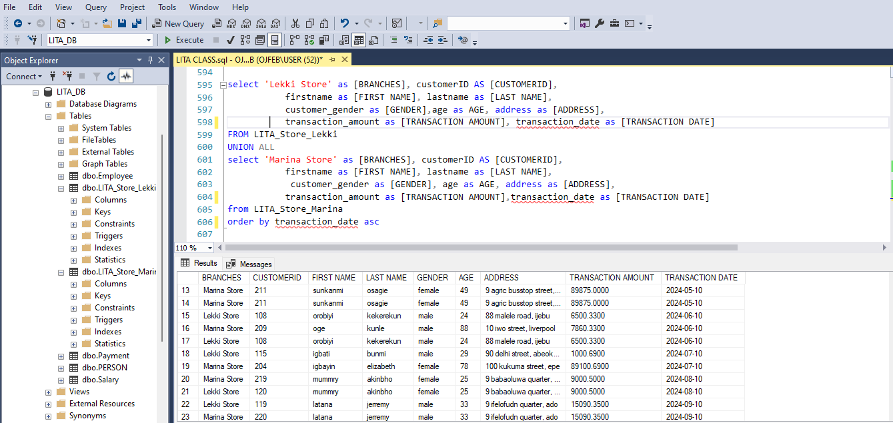
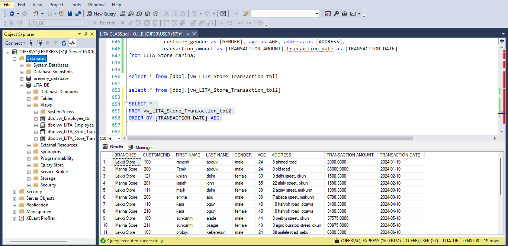
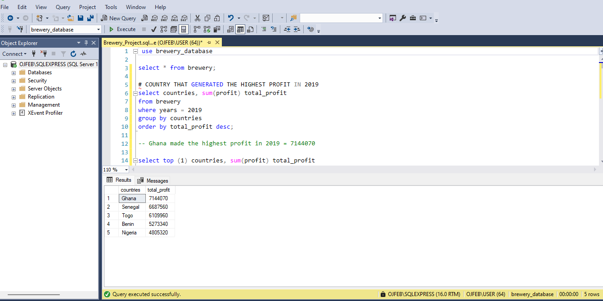

# DATA ANALYTICS LEARNING WITH LITA


[Foundation of Data](#foundation-of-data)

[Tools Used](#tools-used)

[Microsoft Excel Class](#microsoft-excel-class)

[Microsoft Excel Project](#microsoft-excel-project)

[SQL Class](#sql-class)

[SQL Syntax](#sql-syntax)

[SQL Project](#sql-project)

[GitHub Class](#github-class)

[Power BI Class](#power-bi-class)

[Dashboard](#dashboard)

## FOUNDATION OF DATA
The foundation of data refers to the basic principles and concepts that underpin how data is collected, managed, analyzed, and utilized in decision-making processes.
During the first week of training, we delved into several key topics, including data literacy, data generation, data sources, data structure, data storage, and data analysis. I gained an understanding of how organizations operate two primary systems: operational systems, which handle day-to-day transactions, and analytic systems, which focus on data insights and decision-making. A significant part of the discussions was centered on how to efficiently restructure and manage data using the ETL (Extract, Transform, Load) process, which plays a crucial role in transforming raw data into meaningful insights.

## Data Structure
 * Structured Data: Organized data, typically in rows and columns (e.g., databases, spreadsheets).
 * Unstructured Data: Data that doesn’t follow a specific format (e.g., text files, social media posts, videos).
 * Semi-Structured Data: Contains elements of both structured and unstructured data (e.g., XML, JSON).

## Data Storage
It can happen in two main ways:
1. *On-Premises*:  
   - Data is stored within the organization's servers.
   - Accessible only from within the organization.
   - Offers more control and security but requires more maintenance.
2. *Cloud*:  
   - Data is stored remotely in data centers accessed via the internet.
   - Accessible from anywhere with an internet connection.
   - Flexible and scalable but relies on external service providers.
  
## Data Analysis
Data Analysis helps businessess make informed decisions, understand customer behaviour, improve operations, and predict future trends.
  - Helps organizations make decisions based on actual data rather than intuition or guesswork.
  - Identifies inefficiencies in processes, leading optimization and cost reduction.
  - Identifies target markets and creating more effective marketing strategies.
  - Helps in assessing credit risk, fraud detection, and compliance with regulatory standards.
  - It can also enhance transparency with stakeholders, improving the company’s reputation and brand loyalty.
  - Data-driven insights can lead to the development of new products or services by identifying unmet customer needs or market gaps.

## TOOLS USED
  1. Micrsoft Excel for Data cleaning, Analysis, Visualization and Reporting
  2. SQL Server - Structured Query Language for Quering of Data
  3. GitHub for Portfolio Building
  4. Microsoft Power BI for ETL, Data Modeling, Analysis, Visualization and Reporting


## MICROSOFT EXCEL CLASS

### Excel Tools and Data Reporting
We explored Excel in depth, starting with data cleaning and manipulation using various formulas. One of the key focuses was learning how to manage data entry and apply data validation techniques to help minimize errors during the entry process. We practiced a variety of functions:- Arithmetic Functions, Logical Functions, Text Functions and Lookup Functions. Cell referencing was introduced during our session on lookup functions. In our final lecture on Excel, we focused on reporting, where we covered how to create Pivot Tables, Pivot Charts, and build comprehensive reports using these tools.


## MICROSOFT EXCEL PROJECT

## Introduction
I am analyzing sales performance across different dimensions. The data was collected from various regions and markets in Nigeria, focusing on four lines of business.

Fields in the Dataset:
 - **Region:** Geographic area.
 - **Market:** State the store operates in.
 - **Store:** City of the store.
 - **Trade Date:** Date of the transaction.
 - **Fiscal Period:** Financial period.
 - **Model:** Product model or category.
 - **Line of Business:** Business sector.
 - **Day Category:** Transaction day classification (e.g., weekday, weekend).
 - **Revenue:** Total sales amount.
 - **Units Sold:** Quantity of items sold.
 - **Transaction Category:** Each sale is classified into one of these three categories (Low, Medium, or High) based on the number of units sold.

### Data Manipulation


### Pivot Table


### Pivot Chart


### Sales Report Dashboard


## Observation and Conclusion
**Revenue by Region:** The revenue analysis by region highlights the North East as the most profitable area, while the South West and South South also contribute significantly. The North Central region, however, presents an opportunity for further development. Targeted marketing strategies and tailored approaches to increase engagement in lower-performing regions could help optimize overall revenue across the country.

**Monthly Revenue:** By identifying potential seasonal trends, adjusting marketing efforts, and optimizing product offerings, the business can aim to maintain higher revenue levels consistently across all months.
   * Peak Revenue Months: The highest revenue was recorded in March (₦8,458,780,440), followed closely by May (₦8,348,649,000).
   * Decline in Mid-Year: Revenue saw a significant drop starting in July, with monthly figures dropping to below ₦4 billion. This decline continues through December.
   * Lowest Revenue Months: July recorded the lowest revenue at ₦3,976,032,960, with similar low figures in the subsequent months, indicating a potential seasonal downturn.

**Units Sold by Region:** The analysis of units sold by region shows that the North East is the leading market, followed by the South West and South South. The North Central region presents an opportunity for improvement. To optimize overall sales, businesses should consider targeted marketing efforts and strategies aimed at boosting engagement and sales in regions with lower performance.

**Revenue by Transaction Category:** Strategies should prioritize boosting revenue from medium transactions while also seeking opportunities to enhance high-value sales.
   * Low Transaction Category: Despite accounting for the largest number of units sold (14,763 units), the low category generates less revenue compared to the medium category. This suggests that items in this category are priced lower, which impacts the total revenue generated, even though sales volume is high.
   * Medium Transaction Category: This category contributes the largest share of the overall revenue. Even though it ranks second in terms of units sold (12,016 units), the revenue it generates is the highest. This could imply that items in the medium category have a balanced mix of volume and pricing, making it a key driver of revenue.
   * High Transaction Category: Although this category has the lowest number of units sold (4,020 units), it still contributes a notable share of the revenue, which indicates that the items in this category are of higher value, generating more revenue per transaction. However, since fewer units are sold, its contribution to the overall revenue is the smallest.

## SQL CLASS
SQL (Structured Query Language) is a standard programming language specifically designed for managing, querying, and manipulating relational databases. SQL stands for Structured Query Language. 

## SQL Commands
 - SQL commands are instructions. It is used to communicate with the database.
 - It is also used to perform specific tasks, functions, and queries of data.
 - SQL can perform various tasks like create a table, add data to tables, drop the table, modify the table, set permission
for users.
### Types of SQL Commands
There are five types of SQL commands:
 - DDL: Data Definition Language
 - DML: Data Manipulation Language
 - DCL: Data Control Language
 - TCL: Transaction Control Language
 - DQL: Data Query Language

## Key SQL Concepts
1. Databases and Tables
      * Database: A structured collection of data. Think of it as a file cabinet containing organized information.
      * Table: A structured format within a database that consists of rows and columns (similar to Excel spreadsheets). Each row represents a record, and each column represents a field (attribute) within the data.
2. SQL Queries A query is a request for data or information from a database. It allows users to retrieve, insert, update, or delete data from database tables.
3. Data Types Every column in a table has a data type that defines the kind of data it can hold:Numeric Data Types, Character String Data Types, Binary Data Types, Date and Time Data Types.

## SQL Keys
They are fundamental concepts in relational database design and management. They are used to uniquely identify records within tables and establish relationships between different tables. Understanding SQL keys is essential for maintaining data integrity and enforcing constraints within a database.


## SQL Features
These features make SQL a versatile and essential language for working with databases. Whether you're querying data, modifying structures, or ensuring data integrity, SQL provides the necessary tools and capabilities.
Key Features Learned in SQL: SQL Operators, SQL Aggregation functions, SQL Set Operations, SQL Case When Statement, SQL Joins, SQL Clauses, SQL View.


## SQL SYNTAX
```SQL
   CREATE database LITA_DB
```

```SQL
   SELECT * FROM Employee
```
### Creating Database and Table

### SQL Union

### SQL Views

### SQL Case

### SQL Join

### SQL Operators


During our final lecture, we successfully imported a CSV file into SQL, where I had the opportunity to explore and manipulate the dataset using several SQL operators. This involved performing queries to filter, sort, and aggregate the data, which helped me gain a deeper understanding of how to extract meaningful insights from raw data using SQL. The hands-on experience of applying these operators reinforced my learning and enhanced my data analysis skills.

## SQL PROJECT
[Here](https://github.com/OJFEB/LITA_Knowledge_Log/blob/main/SQL_Project.sql) is a link to the SQL script.


## GITHUB CLASS
GitHub has played a crucial role in my data analysis journey with The Incubator Hub, where I learned to create repositories that facilitate the management, documentation, and sharing of my projects.


This documentation reflects my current progress in my learning journey. I have gained valuable skills in data analysis and GitHub, and I am particularly excited about the upcoming Power BI training. I am committed to continuing my growth and applying my knowledge to future projects. The best is yet to come! Thank you 🥰


# POWER BI CLASS
My Power BI journey has truly been an enlightening experience in transforming complex data into meaningful insights that can drive strategic decisions. As I progressed, I became proficient in connecting to a variety of data sources, such as Excel, SQL Server, and various online services. This capability allows me to centralize diverse datasets, enabling streamlined analysis and a more cohesive understanding of the information at hand.

A pivotal skill I’ve developed is the use of Power Query for data cleaning, shaping, and transformation prior to analysis. This stage of the process is critical, as it ensures that the data is accurate and ready for in-depth examination. I have mastered tasks like removing duplicates, changing data types, merging tables, and executing more complex transformations. These steps not only enhance the quality of the data but also ensure that the insights generated are reliable.

In Power BI, I've expanded my expertise in creating calculated fields and measures through DAX (Data Analysis Expressions). This powerful tool enables me to derive insights such as cumulative totals, moving averages, and percentage changes. By harnessing DAX, I can perform advanced analytical functions that provide stakeholders with a richer, more comprehensive view of the data, ultimately allowing for better-informed decision-making.

A significant aspect of my learning has involved visualization design. I've dedicated time to developing dashboards that strike a balance between aesthetic appeal and functional layout. By incorporating elements like slicers, filters, and drill-down features, I’ve created interactive visuals that empower users to engage with the data more meaningfully and explore insights independently.

Through Power BI, I am learning to support data-driven decision-making more effectively. My dashboards not only track key performance indicators (KPIs) and identify trends, but they also communicate performance insights clearly and compellingly. This experience has significantly enriched my data storytelling skills, enabling me to deliver actionable insights that resonate with stakeholders.

Overall, my Power BI journey has been transformative, equipping me with the skills and confidence to turn data into valuable insights. I look forward to continuing this journey, further honing my abilities in data analysis, visualization, and storytelling to make a lasting impact in the field.

## HR ANALYSIS
This project was completed as part of a classroom exercise, where I learned to analyze HR data and present insights using Power BI. The goal was to track key HR metrics, including the total number of employees, attrition count, active employees, attrition rate, and average age.

The dashboard offers a comprehensive look at employee attrition, providing insights that are essential for strategic HR planning. By visualizing attrition by department, educational background, and gender, the dashboard highlights critical patterns in turnover rates. These insights give HR teams a clear starting point for identifying high-risk areas and developing retention strategies tailored to specific groups. Additionally, the dashboard segments data by age groups, with further breakdowns by gender, to deepen the understanding of demographic trends within attrition rates.

Key HR metrics—including hours worked, environmental satisfaction, gender distribution, attrition rates, and work-life balance—are prominently featured, allowing stakeholders to grasp the factors influencing employee retention. The dashboard’s interactive elements, such as filters for job roles and departments, make it adaptable for more detailed analyses, enabling users to pinpoint specific issues within various segments.

This project allowed me to gain hands-on experience with HR analytics, demonstrating the use of Power BI to transform raw data into actionable insights. I created several key measures:
 - Attrition Rate: This measure is calculated by dividing the attrition count by the total number of employees, offering a quick overview of turnover levels across the organization.
 - Active Employees: Derived by subtracting the total attrition count from the overall employee count, this measure indicates the current number of employees who are still with the company.
 - Average Age of Employees: This measure helps to identify the average age of employees within the organization, which can be correlated with attrition trends.
 - Average Distance from Home: By calculating the average commute distance for employees, we can assess if this factor may impact job satisfaction and retention.
 - Average Monthly Income and Monthly Rate: These metrics provide a quick reference for financial benchmarks across different roles, highlighting the overall average monthly income and rate within the organization.
 - Attrition Rate: Calculated as the ratio of attrition count to the total number of employees, this measure offers a quick gauge of turnover intensity across departments, educational fields, and other segments.
 - Active Employees: This measure, calculated by subtracting the total attrition count from the employee count, provides a snapshot of the current workforce size, giving HR teams an accurate picture of employee retention.
These calculated measures contribute to a more granular understanding of employee dynamics and help HR teams prioritize their retention efforts. By engaging with the dashboard, HR professionals can make informed, data-driven decisions that align with the organization’s strategic goals and enhance overall employee satisfaction and retention.

I incorporated three conditional columns into the dataset: one for attrition count, another for age sorting, and a third for job satisfaction ratings. This enhancement provides additional layers of analysis to better understand the factors influencing employee retention.

## Dashboard


## Observations
## **1. Overview Statistics**
 - Number of Employees: There are 1,470 employees in total, with 237 leaving (attrition), resulting in 1,233 active employees.
 - Attrition Rate: The attrition rate stands at 16%, with an average age of employees at 37.
 - Monthly Income and Rate: The average monthly income is NGN 6,833, and the average monthly rate is NGN 14,266.

## **2. Attrition Analysis**
 - By Job Role and Job Satisfaction: The roles with the highest dissatisfaction leading to attrition are Laboratory Technicians (66), Sales Executives (57), and Research Scientists (47). In contrast, Managerial roles show relatively low attrition.
 - By Education Field: Life Sciences has the highest attrition with 89 employees leaving, followed by Medical (63) and Marketing (35).
 - By Department: The Sales department experiences the most attrition (133 employees), followed by R&D (92), and HR (12).
 - By Marital Status: Single employees show the highest attrition (120), compared to those who are married (84) or divorced (33).
 - By Gender: Males have a higher attrition rate at 63%, compared to females at 37%.

## **3. Attrition by Experience and Tenure**
 - Attrition by Year at Company: Most attrition occurs within the first year of employment (50 employees), and it drops significantly after that, stabilizing by the 10-year mark.
 - Attrition by Age Group: The 25-34 age group experiences the highest attrition (112), followed by ages 35-44 (51), and then 45-54 (25).

## **4. Employee Demographics**
 - Gender Distribution: 60% of the workforce is male, while 40% is female. The gender distribution related to attrition reveals that a significant majority, 63%, are male, while 37% are female. This data indicates a notable imbalance in gender representation among those who have left the organization.
 - Age Distribution: The largest group of active employees is aged 25-34, followed by those in the 35-44 age range.
 - Work-Life Balance: Departments like R&D have a relatively high work-life balance score (2619) compared to Sales (1256) and HR (184), which may contribute to differences in satisfaction and attrition.

## **5. Employee Satisfaction and Work Environment**
 - Environment Satisfaction Score: The average score is 584, indicating general satisfaction with the workplace environment.
 - Distance from Home: The average distance from home for employees is 9 miles, which could influence job satisfaction and turnover for those with longer commutes.

## **6. Key Insights and Possible Interventions**
 - High Attrition in Early Years: High turnover within the first year suggests onboarding, training, or role expectations might need improvement.
 - Job Role-Specific Interventions: Targeting attrition reduction in high-turnover roles (e.g., Laboratory Technicians and Sales Executives) with tailored retention programs.
 - Life Sciences and Sales Department Focus: These areas exhibit high attrition and might benefit from reviewing job satisfaction drivers or providing additional support.
 - Work-Life Balance Improvements in Sales and HR: Enhancing work-life balance could mitigate attrition in these departments, especially for younger employees.
 - Focus on Single Employees: High attrition among single employees might suggest a need for benefits or engagement initiatives that resonate more with this demographic.
 - These insights can guide HR initiatives in improving employee satisfaction and retention through targeted actions in onboarding, training, and work-life balance programs, particularly for high-risk groups identified in the dashboard.

## Conclusion
### Conclusion
The HR analysis identifies critical factors influencing employee attrition, enabling targeted retention strategies. Key findings reveal high turnover among younger employees, single employees, and specific roles such as Laboratory Technicians and Sales Executives, particularly within their first year with the company. Departments like Life Sciences and Sales exhibit significantly higher attrition rates, indicating potential issues related to job satisfaction and work-life balance that require attention.

To address these challenges, the organization should enhance onboarding processes, provide tailored support for high-risk roles, and implement work-life balance initiatives, especially within Sales and HR. Improving satisfaction for single employees and those in the early stages of their careers could also contribute to reducing overall attrition. By focusing on these strategies, the organization can strengthen employee retention, lower turnover costs, and cultivate a more stable, satisfied workforce.

The higher departure rates among employees with Life Science backgrounds highlight the need for strategic initiatives aimed at reducing attrition in this demographic. In contrast, the lower turnover rate among individuals with technical degrees suggests effective retention practices are already in place for this group.

By analyzing these trends, the company can gain valuable insights that inform the development of targeted retention strategies, particularly for those in Life Sciences and Medical fields. Tailored programs, including enhanced career development opportunities, mentorship, and work-life balance initiatives, could address the specific needs of these employees. Ultimately, fostering a supportive environment that acknowledges and responds to their challenges will be essential for minimizing turnover and maintaining a stable workforce.

In summary, the comprehensive analysis conducted using Power BI provides valuable insights into various aspects of employee attrition. The trends identified in this report highlight key areas requiring targeted actions to improve retention and cultivate a more engaged workforce.

Feel free to explore the dashboard further for a more detailed view of the data and to interact with specific metrics and visualizations for deeper insights. [Here]([https://app.powerbi.com/links/uJEC4jBrSF?ctid=f9dbb43e-cbfb-4b13-b466-c2630bd47584&pbi_source=linkShare](https://app.powerbi.com/links/uJEC4jBrSF?ctid=f9dbb43e-cbfb-4b13-b466-c2630bd47584&pbi_source=linkShare)) is the link.
